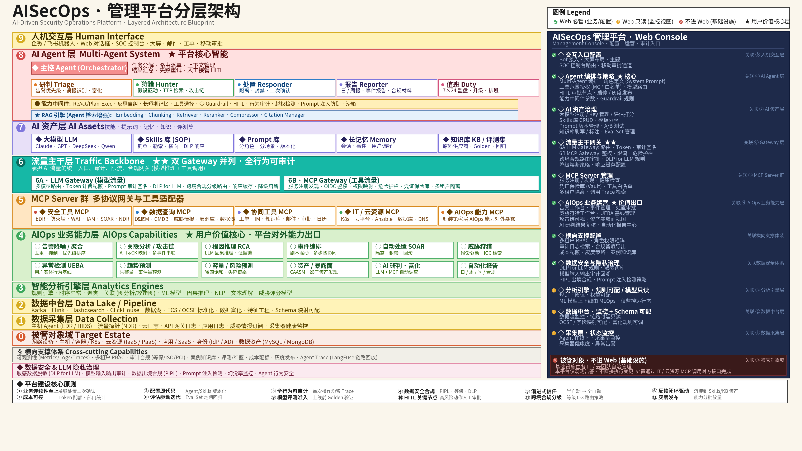

# AISECOPS

> 12 层架构的 AI 驱动安全运营（AISecOps）平台 —— 当前为**架构骨架阶段**



## 项目定位

把 **AI Agent 群 + LLM Gateway + MCP 生态 + 数据中台 + 智能分析引擎** 五大支柱按 12 层架构组织，做一个对标 Microsoft Security Copilot / CrowdStrike Charlotte / 奇安信 QAX-GPT 的国产 AISecOps 平台。

**与同类 ITOps 工具的区别**：本项目从一开始就把"SEC"做成一等公民——L07 业务能力出口、L08 安全分析引擎半边、L11 安全监管对象与 AI 模型合规都是必备项，而不是 AIOps + Chat 的套壳。

## 12 层架构

| 层 | 目录 | 职责 |
|---|---|---|
| L01 | [human_interface](src/aisecops/L01_human_interface/) | 告警面板 / 工单 UI / 报表 UI / Chat 面板 |
| L02 | [agents](src/aisecops/L02_agents/) | Orchestrator + Triage/Investigation/Enrichment/Responder/Reporter/Intel/Tuning + 平台核心管控 |
| L03 | [ai_assets_rag](src/aisecops/L03_ai_assets_rag/) | Embedding / Chunking / Retriever / **Reranker** / Chatbot Manager |
| L04 | [ai_assets_models](src/aisecops/L04_ai_assets_models/) | LLM / **DSLM** / Skills(SOP) / Prompts / Memory / 知识图谱 |
| L05 | [gateway](src/aisecops/L05_gateway/) | **LLM Gateway** + API Gateway |
| L06 | [mcp_servers](src/aisecops/L06_mcp_servers/) | 安全工具 / 数据源 / 协议 / 厂商 / AIOps / 自定义 MCP |
| L07 | [secops_capabilities](src/aisecops/L07_secops_capabilities/) | 告警分诊 / 调查 / 威胁狩猎 / SOAR / UEBA / 漏洞合规 |
| L08 | [analytics_engines](src/aisecops/L08_analytics_engines/) | 异常检测 / 关联 / 根因 / 聚类 / **攻击图 / Kill Chain / IoC / UEBA / 失陷研判** |
| L09 | [data_platform](src/aisecops/L09_data_platform/) | Ingest / 中转池 / ETL / 特征工程 / 数据湖 |
| L10 | [data_collection](src/aisecops/L10_data_collection/) | Agent / Log / Trace / Metric / Sensors |
| L11 | [target_estate](src/aisecops/L11_target_estate/) | 数据库 / **安全资产 / AI 合规** / 云资源 / 流量 |
| L12 | [core_support](src/aisecops/L12_core_support/) | 资产识别 / 调度 / 可观测 / 凭证管理 |

各层 README 含子组件清单、业界对标、当前状态。

## 与业界基线对比

| 维度 | 业界基线 | 本项目设计 |
|---|---|---|
| Multi-Agent 角色分层 | 5+1（Triage/Investigation/Enrichment/Verification/Reporting + Orchestrator） | ✅ 7+1 |
| AI 模型组合 | LLM + DSLM + ML + 统计 + 静态分析 | ✅ L04 + L08 联合覆盖 |
| LLM Gateway | 必备 | ✅ L05 |
| MCP 生态 | 2026 战略要点 | ✅ L06 |
| SEC 能力出口 | 必备 | ✅ L07（6 大能力） |
| 安全分析算法 | 攻击图/Kill Chain/UEBA | ✅ L08 |
| 数据中台 | 企业级 | ✅ L09 |
| AI 模型合规 | 2026 新增基线 | ✅ L11 |
| 训练数据飞轮 | 业界差异化 | 🟡 待补（L02 Tuning Agent + 反馈闭环） |

## 当前状态

🟡 **架构骨架阶段** —— 12 层目录与每层 README 已完成，代码未实现。

## Roadmap

### P0 · 最小可跑 Demo（目标：1-2 周）
1. **L05 LLM Gateway** —— LiteLLM 风格的多 Provider 路由
2. **L02 Orchestrator + 1 个 Triage Agent** —— 最小多 Agent 雏形
3. **L06 1 个 MCP Server** —— 接 Syslog 数据源
4. **L07 1 个端到端场景** —— "告警分诊"走通

### P1 · 安全闭环（目标：1 个月）
5. **L08 攻击图引擎**（图算法基线）
6. **L10 Log/Metric 采集**
7. **L09 ETL 最小管道**
8. **L01 告警面板 + Chat 面板**（React）

### P2 · 平台化（目标：3 个月）
9. **L04 DSLM** 首个领域小模型（日志分类）
10. **L02 Memory Store + Prompt 治理**
11. **L06 MCP 生态** —— SIEM/EDR/TI 三类接入
12. **L11 AI 模型合规模块**

## 技术栈（计划）

| 层级 | 技术 |
|---|---|
| 主语言 | Python 3.11+ |
| Web 框架 | FastAPI |
| Agent 框架 | 暂未选定（候选：LangGraph / 自研） |
| RAG | LlamaIndex |
| LLM Gateway | LiteLLM 或自研 |
| MCP | Anthropic MCP Python SDK |
| 数据中台 | Kafka + ClickHouse + MinIO（计划） |
| 前端 | React + TypeScript（L01） |

## 目录结构

```
AISECOPS/
├── README.md                    # 本文件
├── pyproject.toml
├── .gitignore
├── docs/
│   ├── README.md
│   └── architecture.png         # 视觉权威架构图
├── src/aisecops/
│   ├── L01_human_interface/
│   ├── L02_agents/
│   ├── L03_ai_assets_rag/
│   ├── L04_ai_assets_models/
│   ├── L05_gateway/
│   ├── L06_mcp_servers/
│   ├── L07_secops_capabilities/
│   ├── L08_analytics_engines/
│   ├── L09_data_platform/
│   ├── L10_data_collection/
│   ├── L11_target_estate/
│   └── L12_core_support/
└── tests/
```

## 许可

MIT
